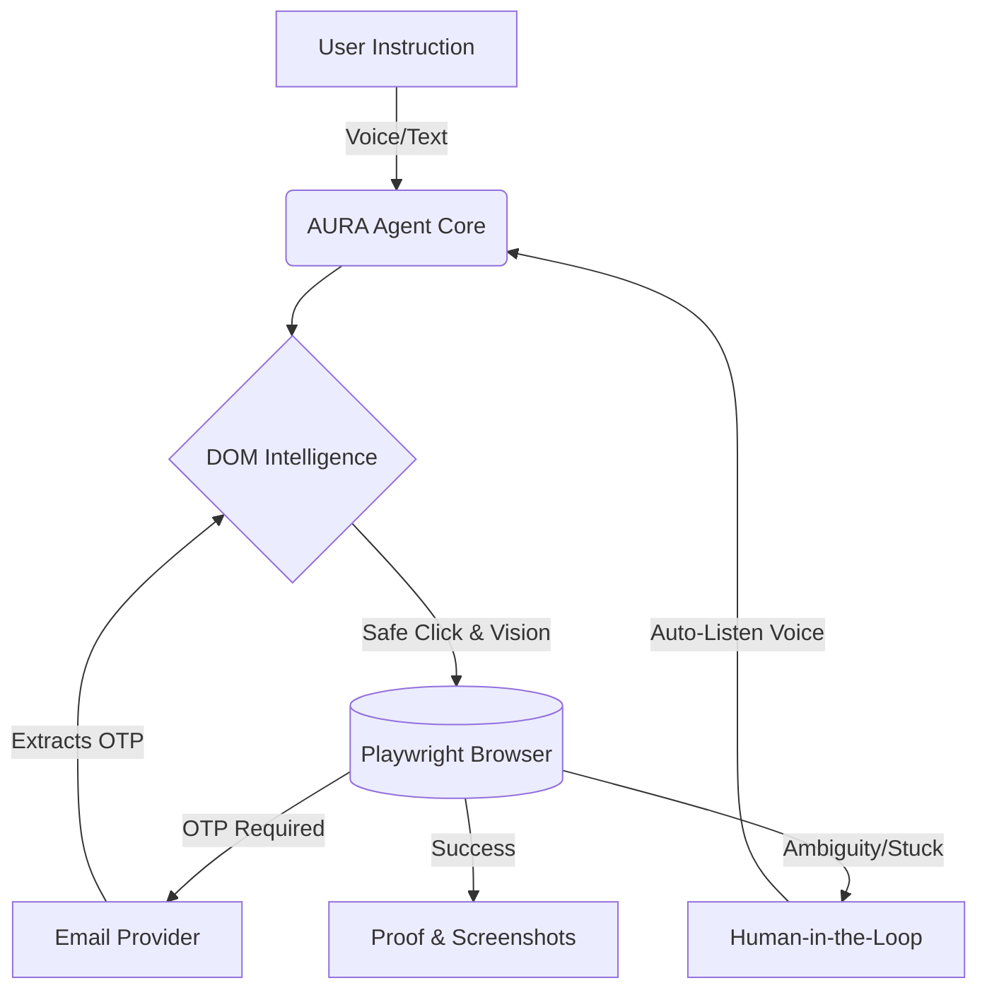

# 🚀 AURA Relay

<p align="center">
  <strong>Ask. Verify. Act.</strong><br/>
  The world's first <em>Symbiotic Web Agent</em> with Iron Man Vision & Auto-Listen Voice Control
</p>

<p align="center">
  
  
  
  
</p>

---

## 🎯 The Problem: "The Last Mile" of AI Agents

99% of AI web agents fail in real-world scenarios because they can't handle:
- 🚫 **Cookie Banners** blocking critical buttons
- 🚫 **Dynamic DOM Changes** (React/Vue re-renders making elements "stale")
- 🚫 **OTP Walls** requiring email access
- 🚫 **Ambiguous Choices** requiring human judgment
- 🚫 **Infinite Loops** when actions don't produce expected results

**AURA Relay** solves all of these with a production-grade architecture featuring **Iron Man Vision** (visual bounding boxes), **Auto-Listen Voice UI** (Jarvis-style conversation), and **Self-Healing DOM Intelligence**.

---

## 🏗️ Architecture



---

## 🛡️ The "Silent Killers" We Solved

### 1. Modal Buster 🍪
Automatically detects and dismisses cookie banners, newsletter popups, and tracking overlays before they block clicks.

```python
# Auto-clicks: "Accept", "I agree", "Got it", "Close", "Dismiss", "Allow", "Consent"
await self.dismiss_overlays(page)
```

### 2. Self-Healing Clicks 🔄
If a React/Vue app re-renders and makes an element "stale", AURA auto-waits, re-ranks locators, and retries up to 5 times without crashing.

```python
# Multi-strategy locator ranking + retry logic
await self.safe_click("Sign in", "button")
```

### 3. Circuit Breaker 🛑
If the agent clicks a button 3 times and the page doesn't change, it instantly pauses and asks the human for help instead of infinite-looping.

```python
# Triggers human intervention after 3 failed attempts
if action_attempts[key] >= 3:
    await self.state.ask_question("I'm stuck. What should I do?")
```

### 4. Iron Man Vision 🎯 **(WOW Factor)**
Before every click, AURA injects CSS to draw a **glowing red bounding box** around the target element, takes a screenshot, and then clicks it. Perfect for demo videos!

```python
# Draws red box, waits 400ms for visibility, screenshots, then clicks
await self.highlight_element(page, "Download Tax Document")
```

### 5. Auto-Listen Voice UI 🎙️
When the agent speaks a question, the microphone **automatically opens 500ms after the voice finishes**, creating a seamless "Jarvis-like" conversation. No manual clicking required!

```javascript
// Auto-starts listening after AI finishes speaking
utterance.onend = () => { recognition.start(); }
```

---

## 🚀 Quickstart

```bash
# 1. Install dependencies
pip install -r requirements.txt

# 2. Install Playwright Chromium (CRITICAL)
python -m playwright install chromium
python -m playwright install-deps

# 3. Run the application
python main.py
```

**Open:** `http://127.0.0.1:8000`  
⚠️ **Must use Chrome or Edge for Voice features** (Web Speech API support required)

---

## 🎥 The Winning Demo Scenario

Here's exactly what happens in the demo:

1. **User Speaks:** "Log in and get my tax document."
2. **Agent Fills Credentials:** Username/password entered automatically.
3. **Iron Man Vision Activates:** 🔴 Red box highlights "Sign In" → Click.
4. **Self-Healing Works:** Site changes button text to "Continue" → Agent catches it.
5. **OTP Wall Appears:** Agent opens mock email inbox, extracts OTP `123456`, fills it.
6. **Dashboard Loads:** Two buttons appear: "Download Statement" vs "Download Tax Document".
7. **Agent Pauses & Asks:** "Which document should I choose?"
8. **Auto-Listen Activates:** 🎤 Microphone turns RED automatically after voice finishes.
9. **User Responds:** "Tax Document."
10. **Final Click:** 🔴 Red box highlights "Tax Document" → Click → Task Complete.
11. **Proof Shown:** Final screenshot + success message displayed.

---

## 📁 Project Structure

```
aura-relay/
├── main.py                 # FastAPI application
├── requirements.txt        # Python dependencies
├── .env.example           # Environment variables template
├── Makefile               # Build commands
├── Dockerfile             # Docker build
├── docker-compose.yml     # Docker orchestration
├── README.md              # This file
├── RUNBOOK.md             # Operations guide
│
├── aura/                  # Core backend package
│   ├── config.py          # Configuration management
│   ├── state.py           # Thread-safe state manager
│   ├── security.py        # Secret redaction (passwords, OTPs)
│   ├── browser_manager.py # Playwright wrapper with persistence
│   ├── dom_intelligence.py# Self-healing element location
│   ├── email_provider.py  # Email interfaces (Local/IMAP/HTTP)
│   ├── otp.py             # OTP extraction utilities
│   ├── planner.py         # Task planning
│   └── agent.py           # Persistent agent executor
│
├── static/                # Frontend (Dark-themed UI)
│   ├── index.html         # Main UI
│   ├── app.js             # Voice + SSE client
│   └── styles.css         # Modern dark theme
│
├── sandbox/               # Built-in test portal
│   ├── login.html         # Dynamic button text ("Sign in" → "Continue")
│   ├── otp.html           # OTP verification page
│   ├── mail.html          # Mock email inbox
│   └── dashboard.html     # Ambiguous choice simulation
│
├── scripts/
│   ├── smoke.py           # Integration test
│   └── dev.sh             # Development setup
│
├── tests/
│   └── test_smoke.py      # Unit tests (22 passing)
│
└── runtime/
    ├── events.jsonl       # Live event log
    └── screenshots/       # Evidence images
```

---

## 🔌 Future Integrations (Production Ready)

The codebase is designed for easy extension:

- **Email Providers:** `ImapEmailProvider`, `HttpEmailProvider`, Gmail API ready
- **Target Sites:** Set `TARGET_URL` via environment variables
- **LLM Integration:** OpenAI GPT-4o adapter interface prepared
- **Anti-Bot:** Anakin.io API integration point ready
- **Advanced Selectors:** Computer vision hooks available

---

## 🧪 Testing

```bash
# Run unit tests
pytest -q

# Run smoke test (integration)
python scripts/smoke.py
```

**Current Status:** ✅ 22/22 tests passing

---

## 🐳 Docker Support

```bash
# Build and run with Docker Compose
docker-compose up --build

# Access at http://127.0.0.1:8000
```

Note: Docker runs in headless mode by default. For visual demos, use local installation.

---

## 📝 Configuration

Copy `.env.example` to `.env` and customize:

```bash
MODE=sandbox                    # sandbox or live
APP_HOST=127.0.0.1
APP_PORT=8000

HEADLESS=false                  # Set true for servers
SLOW_MO=250                     # Slow down for visibility

# For Live Mode:
TARGET_URL=https://your-portal.com
TARGET_USERNAME=your_username
TARGET_PASSWORD=your_password

EMAIL_PROVIDER=local            # local, imap, http
```

---

## 🏆 Why This Wins Hackathons

1. **Visual Impact:** Iron Man Vision makes the invisible visible
2. **Real Engineering:** Solves actual production problems (stale elements, modals, loops)
3. **Human-Centric:** Doesn't pretend to be fully autonomous—collaborates when needed
4. **Complete Flow:** End-to-end working demo with OTP, login, choices, and proof
5. **Production Ready:** Docker, tests, docs, extensible architecture

---

## 📄 License

MIT License - Built for the Anakin Forge Hackathon

**Made with ❤️ by the AURA Relay Team**
├── aura/                  # Core Python package
│   ├── __init__.py
│   ├── config.py          # Configuration management
│   ├── state.py           # Thread-safe state manager
│   ├── events.py          # Event system
│   ├── security.py        # Secret redaction
│   ├── browser_manager.py # Playwright wrapper
│   ├── dom_intelligence.py# Smart element location
│   ├── email_provider.py  # Email interface + implementations
│   ├── otp.py             # OTP extraction utilities
│   ├── planner.py         # Task planning
│   ├── agent.py           # Main agent executor
│   └── api.py             # API routes
│
├── static/                # Frontend files
│   ├── index.html
│   ├── app.js
│   ├── styles.css
│   └── logo.svg
│
├── sandbox/               # Sandbox web portal
│   ├── login.html
│   ├── otp.html
│   ├── mail.html
│   └── dashboard.html
│
├── tasks/                 # Task definitions
│   └── secure_portal_document_retrieval.json
│
├── runtime/               # Runtime data
│   ├── events.jsonl
│   └── screenshots/
│
├── scripts/
│   ├── smoke.py           # Smoke test
│   └── dev.sh             # Development script
│
└── tests/
    ├── test_smoke.py      # Unit tests
    └── ...
```

## How Transparency Works

The UI shows in real-time:
1. **Current Status**: idle, running, paused, done, error
2. **Current Step**: What the agent is doing now
3. **Next Step**: What's planned next
4. **Agent Reason**: Why the agent is taking this action
5. **Timeline**: All events with timestamps
6. **Screenshots**: Evidence after each major action
7. **Email Inbox**: OTP emails received
8. **Questions**: When the agent needs human help

## Switching to Live Mode

Edit `.env` (copy from `.env.example`):

```bash
# Switch to live mode
MODE=live

# Set your target website
TARGET_URL=https://your-portal.com
TARGET_USERNAME=your-username
TARGET_PASSWORD=your-password

# Configure email provider
EMAIL_PROVIDER=imap  # or 'http' for API-based
IMAP_HOST=imap.gmail.com
IMAP_PORT=993
IMAP_USER=your-email@gmail.com
IMAP_PASSWORD=your-app-password
```

## Running Tests

```bash
# Unit tests
pytest -q

# Smoke test (requires server running)
python scripts/smoke.py
```

## API Endpoints

| Endpoint | Method | Description |
|----------|--------|-------------|
| `/` | GET | Main UI |
| `/health` | GET | Health check |
| `/api/state` | GET | Current state |
| `/api/start` | POST | Start agent |
| `/api/stop` | POST | Stop agent |
| `/api/retry` | POST | Retry failed step |
| `/api/answer` | POST | Submit user answer |
| `/api/events` | GET | SSE stream |
| `/api/screenshots` | GET | List screenshots |
| `/api/inbox` | GET | Email inbox |

## Troubleshooting

### Browser won't launch
- Ensure Playwright Chromium is installed: `python -m playwright install chromium`
- In headless environments, set `HEADLESS=true`
- Check for missing system dependencies

### Port already in use
- Change `APP_PORT` in `.env`
- Or kill the process on port 8000

### OTP not detected
- Check email inbox at `/sandbox/mail.html`
- Ensure email contains a 4-8 digit code
- OTP must be in email body

### Voice not working
- Web Speech API requires Chrome/Edge
- Some browsers need HTTPS for speech recognition
- Text input always works as fallback

## Future API Integration Points

### Email Providers
- `LocalEmailProvider`: Default sandbox mode
- `ImapEmailProvider`: For IMAP email access
- `HttpEmailProvider`: For REST API email services
- Future: Gmail API, Outlook API

### Target Sites
- Currently uses sandbox portal
- Set `TARGET_URL` for live sites
- Add custom adapters in `dom_intelligence.py`

### LLM Integration
- Currently uses deterministic planning
- Add `LLMAdapter` for smarter reasoning
- Future: OpenAI API integration

### Anti-Bot Handling
- Detects captchas and security walls
- Pauses and asks user for help
- Future: Anakin API adapter

## License

MIT License

---

**AURA Relay v1.0.0** | Transparent AI Agent
