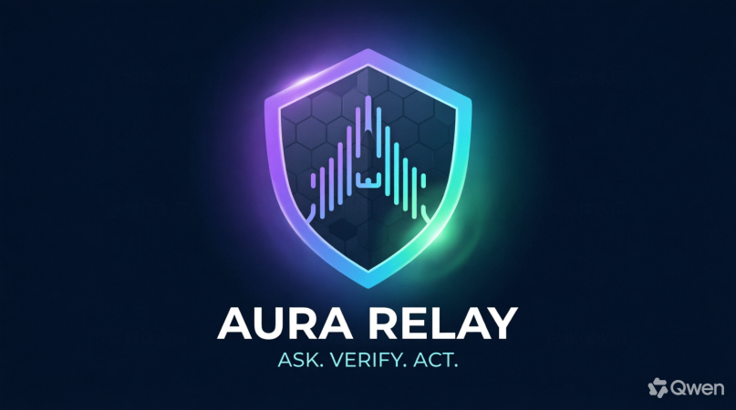
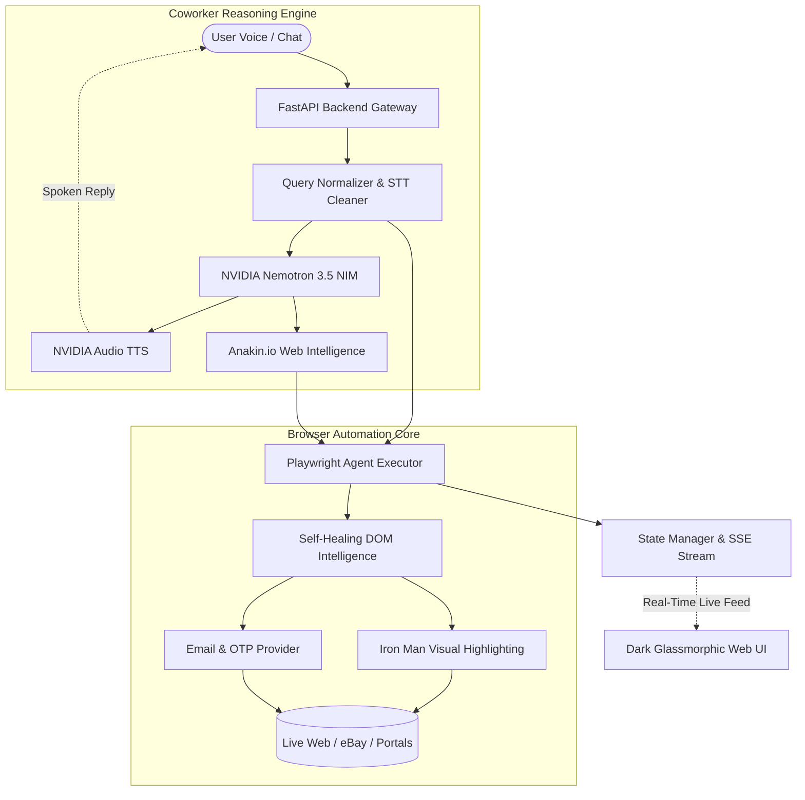

<p align="center">
  
</p>

<h1 align="center">AURA Relay</h1>
<p align="center">
  <b>ASK. VERIFY. ACT.</b><br/>
  <em>Next-Generation Autonomous AI Browser Coworker with Real-Time Voice, Iron Man Vision & Anti-Block Web Intelligence</em>
</p>

<p align="center">
  <a href="https://github.com/VarshneysvAI/AURA-RELAY"></a>
  
  
  
  
  
  
  
</p>

---

## 🌟 Overview

**AURA Relay** is an autonomous AI browser coworker that combines conversational intelligence, voice interaction, and resilient browser automation. Unlike brittle web scrapers or simple wrapper scripts, AURA Relay understands natural human conversation, handles complex e-commerce and enterprise workflows, bypasses authentication and OTP barriers, and keeps the user in control with real-time audio and visual transparency.

### Why Existing Web Agents Fail
- ❌ **Brittle Search Queries**: Sending raw conversational sentences (e.g. *"do one thing find professional watches no budget brand can be seafood"*) directly into search bars returns 0 results.
- ❌ **Anti-Bot & Dynamic DOM Walls**: Overlays, consent dialogs, and React/Vue hydration destroy element selectors.
- ❌ **Authentication & 2FA Walls**: Inability to extract time-sensitive OTP verification codes.
- ❌ **Lack of Human Oversight**: Agents get trapped in infinite click loops or guess blindly when options are ambiguous.

**AURA Relay** solves every single one of these challenges with a production-grade multi-layer architecture.

---

## 🚀 Key Features

### 🎙️ Conversational Coworker & Real-Time Voice
- **Natural Voice Conversations**: Real-time voice synthesis powered by **NVIDIA NIM Audio TTS** (`Aria` voice model) with instant client playback.
- **Auto-Listen Microphone**: Seamless voice duplexing using the Web Speech API—the microphone automatically activates after the agent speaks, enabling hands-free conversation.
- **Interactive Clarifications**: Asks clarifying questions upfront only when requirements are missing or ambiguous.

### ⚡ Intelligent Query Normalizer & STT Cleaner
- **Strips Conversational Noise**: Eliminates filler phrases (*"do one thing"*, *"do me a favor"*, *"what you can do is"*).
- **Parses Constraints & Budgets**: Extracts price bounds (*"$300 watches"*) while properly handling unconstrained budgets (*"no target budget"*).
- **Phonetic & Acoustic Error Correction**: Automatically resolves speech-to-text misrecognitions in context (e.g., corrects acoustic errors like *"seafood"* $\rightarrow$ *"Seiko"* for watches).
- **Target URL Construction**: Generates clean, laser-focused search parameters for **eBay, Amazon, Wikipedia, YouTube, and Google**.

### 🌐 Anakin.io Web Intelligence
- **Live Search & Pre-Flight Sourcing**: Queries live search indexes before browser navigation to discover direct product and article links.
- **Anti-Block Scraping**: Resilient data extraction across e-commerce and media platforms.

### 👁️ Iron Man Vision & Self-Healing DOM
- **Visual Bounding Boxes**: Injects dynamic glowing bounding boxes around interactive elements before taking actions, creating real-time visual proof of agent intent.
- **Self-Healing Selectors**: Multi-strategy locators (ARIA labels, text content, CSS hierarchy, test IDs) that automatically adapt if the DOM shifts.
- **Overlay & Modal Buster**: Auto-detects and dismisses cookie consent popups, newsletter overlays, and blocking dialogs.

### 🛡️ Enterprise Security & 2FA Bypassing
- **OTP Inbox Verification**: Automatically checks local or IMAP email inboxes, extracts 4–8 digit verification codes, and fills 2FA screens without human delay.
- **Circuit Breaker**: Detects unproductive action repetitions and safely pauses to ask for guidance rather than looping infinitely.
- **Secret Redaction**: Masks passwords, tokens, and verification codes from client logs and SSE streams.

---

## 🏗️ Architecture



---

## 📂 Repository Structure

```
AURA-RELAY/
├── main.py                     # FastAPI server, endpoints, and coworker lifespan
├── requirements.txt            # Python dependencies
├── .env.example                # Configuration template
├── Dockerfile                  # Production container definition
├── docker-compose.yml          # Docker Compose configuration
├── Makefile                    # Standard developer automation commands
├── README.md                   # Repository documentation
│
├── aura/                       # Core system package
│   ├── agent.py                # ReAct browser agent execution loop
│   ├── anakin_client.py        # Anakin.io search & web intelligence client
│   ├── browser_manager.py      # Playwright stealth browser wrapper
│   ├── config.py               # Settings loader & environment manager
│   ├── dom_intelligence.py     # Self-healing selectors, overlay buster, listings extractor
│   ├── email_provider.py       # Local and IMAP email inbox handlers
│   ├── llm_provider.py         # NVIDIA NIM Nemotron LLM integration
│   ├── otp.py                  # Regex & heuristic OTP code extraction
│   ├── query_cleaner.py        # Conversational query normalization & URL generator
│   ├── security.py             # Secret redaction & sensitive data masking
│   ├── state.py                # Thread-safe application state & SSE event dispatcher
│   └── tts_provider.py         # NVIDIA NIM Audio speech synthesizer
│
├── static/                     # Frontend client
│   ├── index.html              # Dark glassmorphic coworker interface
│   ├── styles.css              # Custom styling, animations & waveform visualizer
│   ├── app.js                  # SSE listener, audio player & Web Speech integration
│   ├── logo.svg                # Brand vector logo
│   └── logo.png                # Brand high-res logo
│
├── sandbox/                    # Local integration test fixtures
│   ├── login.html              # Dynamic portal login page
│   ├── otp.html                # 2FA OTP verification mock
│   ├── mail.html               # Mock email inbox
│   └── dashboard.html          # Ambiguous multi-choice document selector
│
├── scripts/                    # Helper & developer scripts
│   ├── smoke.py                # End-to-end integration test runner
│   ├── dev.sh                  # Development environment launcher
│   └── push-to-github.sh       # Git deployment script
│
└── tests/                      # Automated test suite
    ├── test_smoke.py           # Unit tests for state, DOM, security & OTP (22 tests)
    └── test_v2_features.py     # Tests for conversational query cleaner & LLM parser (2 tests)
```

---

## ⚡ Quickstart

### 1. Prerequisites
- **Python**: 3.11 or higher
- **Browser**: Google Chrome or Microsoft Edge (required for Web Speech recognition)

### 2. Installation

```bash
# Clone the repository
git clone https://github.com/VarshneysvAI/AURA-RELAY.git
cd AURA-RELAY

# Create and activate virtual environment
python -m venv .venv
# On Windows:
.venv\Scripts\activate
# On macOS/Linux:
source .venv/bin/activate

# Install dependencies
pip install -r requirements.txt

# Install Playwright browser binaries
playwright install chromium
```

### 3. Environment Configuration

Copy the sample configuration file and configure your API keys:

```bash
cp .env.example .env
```

Key environment variables in `.env`:
```ini
# Application Mode (live or sandbox)
MODE=live
APP_HOST=127.0.0.1
APP_PORT=8000
HEADLESS=false
SLOW_MO=250

# Anakin.io Web Intelligence
ANAKIN_API_KEY=your_anakin_api_key
ANAKIN_BASE_URL=https://api.anakin.io/v1

# NVIDIA NIM AI Services
NVIDIA_LLM_API_KEY=your_nvidia_api_key
NVIDIA_LLM_MODEL=nvidia/nemotron-3.5-lightning-30b-a3b
NVIDIA_LLM_BASE_URL=https://integrate.api.nvidia.com/v1

# NVIDIA NIM Text-to-Speech
NVIDIA_TTS_API_KEY=your_nvidia_tts_key
NVIDIA_TTS_VOICE=Magpie-Multilingual.EN-US.Aria
NVIDIA_TTS_BASE_URL=https://877104f7-e885-42b9-8de8-f6e4c6303969.invocation.api.nvcf.nvidia.com/v1/audio/synthesize
```

### 4. Running the Application

```bash
python main.py
```

Navigate to **`http://127.0.0.1:8000`** in Chrome or Edge.

---

## 🧪 Testing

AURA Relay includes a comprehensive automated test suite covering DOM intelligence, security redactions, state management, OTP extraction, conversational query cleaning, and speech recognition normalization.

```bash
# Run all automated tests
pytest tests/ -v
```

**Results**:
```
============================= 24 passed in 1.09s ==============================
```

---

## 📡 API Reference

| Method | Endpoint | Description |
|---|---|---|
| `GET` | `/` | Serves the dark glassmorphic Coworker dashboard |
| `GET` | `/health` | Service health status and active mode check |
| `GET` | `/api/state` | Returns current state, agent status, and live log history |
| `POST` | `/api/chat` | Conversational coworker endpoint combining LLM reasoning, Anakin search, and TTS |
| `POST` | `/api/start` | Initiates autonomous browser execution for a specific task |
| `POST` | `/api/stop` | Halts active browser automation immediately |
| `POST` | `/api/answer` | Submits human response to an active clarification prompt |
| `GET` | `/api/events` | Server-Sent Events (SSE) stream for live UI synchronization |
| `GET` | `/api/screenshots` | Returns metadata and paths for visual evidence captures |
| `GET` | `/api/inbox` | Inspects current email inbox for OTP verification |

---

## 🐳 Docker & Deployment

AURA Relay can be deployed as a containerized service or on a cloud virtual server.

### Running with Docker Compose

```bash
# Build and start container
docker-compose up --build -d

# Check container logs
docker-compose logs -f
```

*Note: In containerized environments, set `HEADLESS=true` in your `.env` so Playwright runs headless with virtual framebuffer (Xvfb) support.*

---

## 📄 License

This project is licensed under the **MIT License**. See the [LICENSE](LICENSE) file for details.

Developed with ❤️ by the **AURA Relay Team**.
